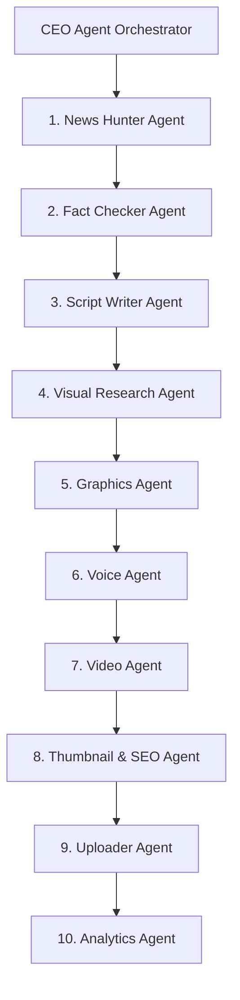
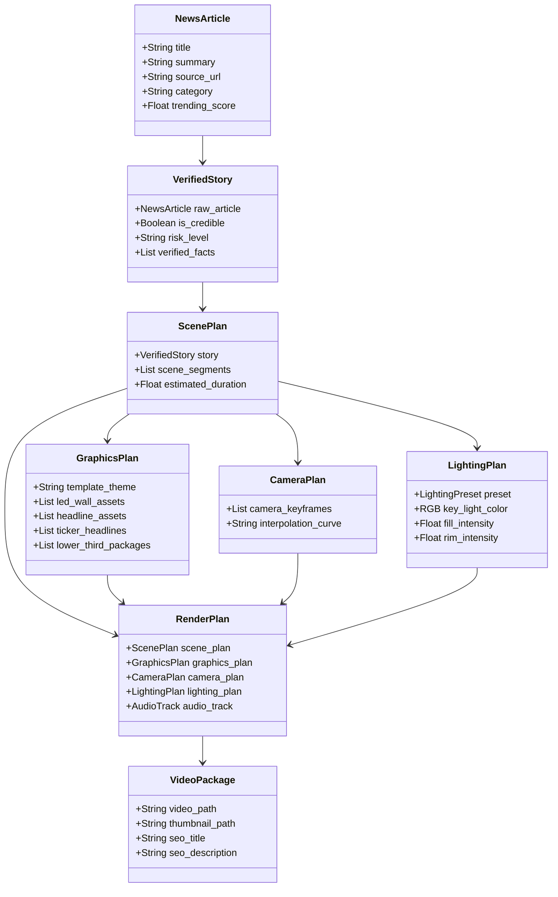
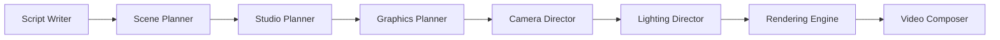
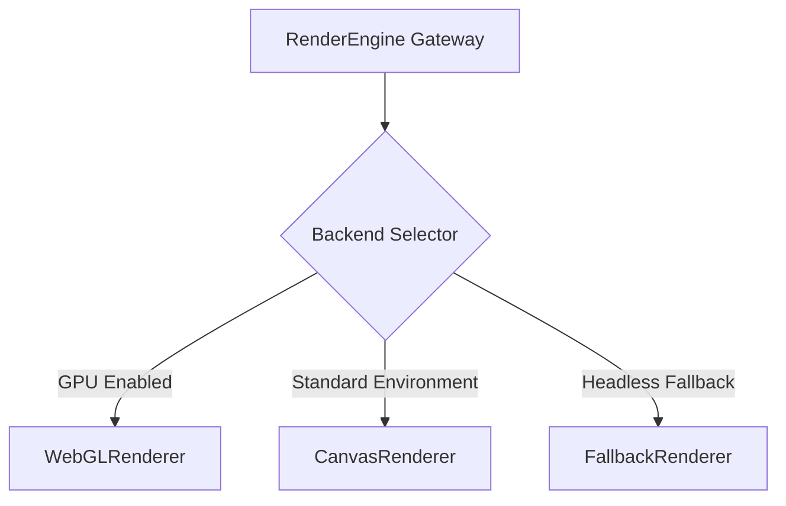
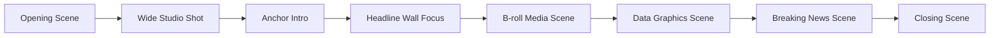
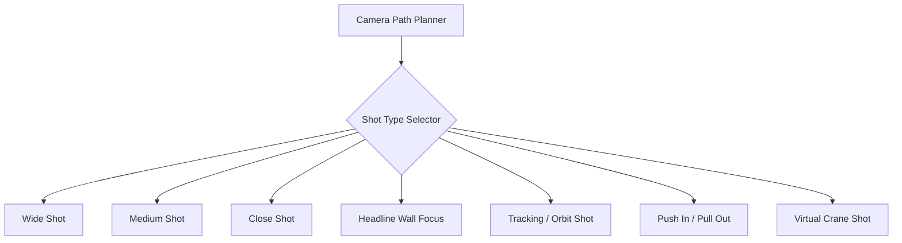
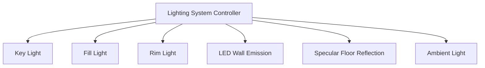
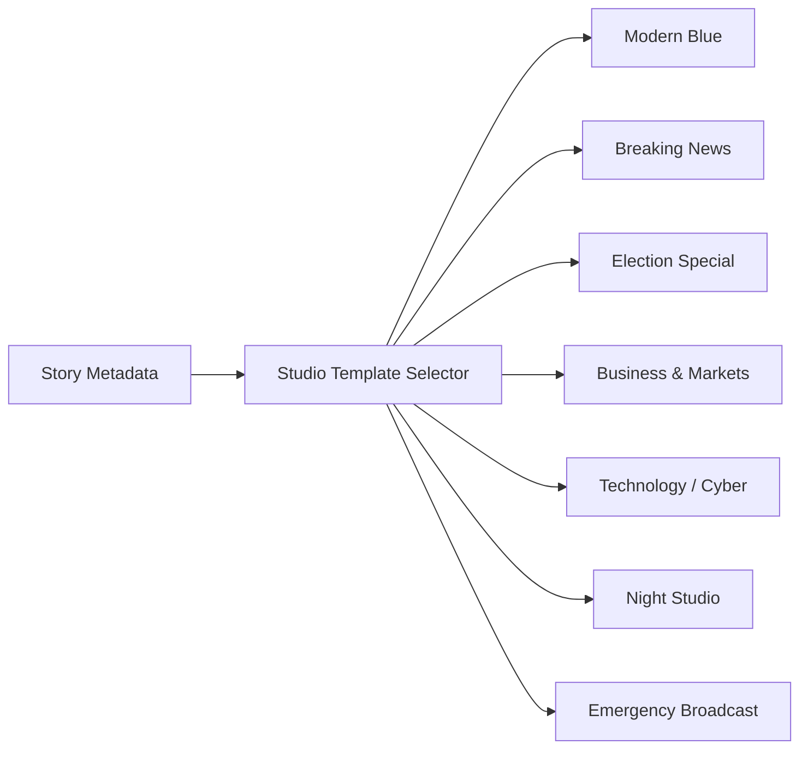
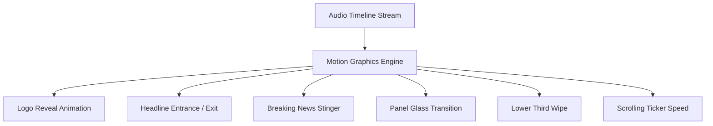

# AI-NewsTube: Production Virtual News Studio Architecture

**Author:** Lead Software Architect  
**Status:** Approved Architectural Specification  
**Target:** Production-Grade AI Virtual TV Broadcasting Studio Engine  
**Classification:** Technical Architecture & Systems Engineering Specification  

---

## 1. System Overview

AI-NewsTube is an autonomous, end-to-end multi-agent AI video production engine designed to generate professional, broadcast-ready TV news broadcasts matching modern television network standards (e.g., BBC, CNN, NDTV, Sky News).

The platform transforms raw multi-category RSS news feeds into 1080p 60FPS Full HD broadcast packages featuring virtual newsroom environments, dynamic curved LED displays, specular floor reflections, dynamic camera trajectories, atmospheric lighting, kinetic lower thirds, and breaking news graphical packages—operating with zero manual intervention.

### 1.1 Architectural Goals
- **Decoupled Planning vs. Rendering**: Eliminate inline rendering logic from business agents. The rendering engine operates as a pure execution pipeline consuming immutable declarative render plans.
- **Modular Virtual Studio Environment**: Shift graphics from flat post-processing overlays to fully spatialized, 3D broadcast elements anchored inside a virtual studio space.
- **Strict Data Contracts**: Replace monolithic state payloads with single-responsibility, immutable data models representing specific pipeline lifecycle stages.
- **Backend-Agnostic Render Abstraction**: Decouple visual scene descriptions from the underlying graphics backend, enabling multi-backend rendering (WebGL, Canvas, or Headless Fallbacks).
- **High-Retention Motion Graphics**: Enforce timing-synchronized motion keyframes aligned with neural audio RMS and script segment transitions.

---

## 2. Agent Responsibilities & Pipeline Workflow

The high-level business workflow remains orchestrated by the **CEO Agent**, preserving existing multi-agent operational boundaries while delegating graphic design and visual composition to specialized sub-systems.



### 2.1 Agent Domain Boundaries

| Agent | Core Responsibility | Input Artifact | Output Artifact |
| :--- | :--- | :--- | :--- |
| **CEO Agent** | Pipeline lifecycle management, error propagation control, and state machine orchestration. | System Trigger / Cron | Published Broadcast Package |
| **News Hunter** | Ingests RSS feeds across 9 categories; ranks virality via Jaccard overlap and keyword scoring. | RSS Source Feeds | `NewsArticle` |
| **Fact Checker** | Verifies news credibility, checks source authenticity, and evaluates risk profiles. | `NewsArticle` | `VerifiedStory` |
| **Script Writer** | Generates a 6-stage broadcast news script (Hook, Intro, Context, Deep-Dive, Climax, Outro). | `VerifiedStory` | `ScenePlan` |
| **Visual Research** | Procures real-world HD news photography via 5-tier API fallbacks (Wikimedia, NASA, Pexels, etc.). | `ScenePlan` | Media Enriched `ScenePlan` |
| **Graphics Agent** | Orchestrates spatial studio composition, camera trajectories, lighting, and motion graphic packages. | Enriched `ScenePlan` | `RenderPlan` (`GraphicsPlan` + `CameraPlan` + `LightingPlan`) |
| **Voice Agent** | Synthesizes neural audio voiceovers with expressive vocal direction and speed control. | `ScenePlan` Text | Master Audio Stream + Subtitles |
| **Video Agent** | Executes multi-backend frame rendering and composite encoding into 1080p MP4. | `RenderPlan` + Master Audio | Final Broadcast MP4 |
| **Thumbnail & SEO**| Generates high-CTR thumbnails and YouTube-ready SEO metadata (Title, Description, Tags). | Broadcast MP4 + `VerifiedStory` | Thumbnail PNG + SEO Package |
| **Uploader Agent**| Stages final broadcast artifacts for publishing and distribution networks. | Broadcast Package | Publishing Confirmation |
| **Analytics Agent**| Logs rendering telemetry, system execution times, and pipeline performance metrics. | Execution Logs | Performance Report |

---

## 3. Data Models Architecture

To eliminate state contamination and structural coupling, the single monolithic payload (`GeneratedScript`) is decomposed into 8 immutable, strongly-typed domain models.



### 3.1 Model Descriptions & Architectural Justification

1. **`NewsArticle`**: Encapsulates raw RSS telemetry, headline text, source URL, and keyword virality score.  
   *Justification*: Prevents unverified web scraping data from polluting downstream rendering models.

2. **`VerifiedStory`**: Contains fact-checking verification, LLM credibility reasoning, and risk classification (`LOW`, `MEDIUM`, `HIGH`).  
   *Justification*: Ensures invalid or high-risk news stories are halted before script planning begins.

3. **`ScenePlan`**: Breaks down the news story into structural broadcast segments (Opening, Wide Shot, Anchor Intro, Headline Wall, B-roll, Outro).  
   *Justification*: Establishes temporal structure independent of visual styling or rendering parameters.

4. **`GraphicsPlan`**: Defines spatial display allocation, LED wall media mapping, lower thirds text, breaking news badges, and side display content.  
   *Justification*: Completely decouples graphic visual elements from camera motion and lighting states.

5. **`CameraPlan`**: Specifies sequence of virtual camera positions, field of view (FOV), target focal points, and motion timing keyframes.  
   *Justification*: Allows visual camera direction to be planned independently of spatial graphic elements.

6. **`LightingPlan`**: Controls key, fill, and rim light positioning, color temperatures, light sweep speeds, and specular floor reflection intensity.  
   *Justification*: Separates environmental illumination controls from geometry creation and media assets.

7. **`RenderPlan`**: Unified, immutable master execution blueprint combining `ScenePlan`, `GraphicsPlan`, `CameraPlan`, `LightingPlan`, and audio timing tracks.  
   *Justification*: Serves as the complete declarative payload passed directly to the Rendering Engine.

8. **`VideoPackage`**: Represents final post-production artifacts including 1080p MP4 file path, thumbnail image, audio voiceover file, and SEO metadata.  
   *Justification*: Encapsulates completed distribution assets for Uploader and Analytics agents.

---

## 4. Decoupled Planning Pipeline

The visual generation workflow separates creative decision-making from frame generation through a multi-stage planning pipeline:



### 4.1 Module Responsibilities

- **Script Writer**: Formulates the core narrative structure across 6 distinct news segments.
- **Scene Planner**: Maps script narrative blocks into discrete visual broadcast scenes with explicit timestamp boundaries.
- **Studio Planner**: Selects studio layout templates (e.g., Modern Blue, Breaking News, Election) based on topic category and urgency score.
- **Graphics Planner**: Assigns visual assets, headline text, lower-third overlays, and breaking news packages to specific physical locations within the virtual studio layout.
- **Camera Director**: Generates smooth virtual camera trajectories (swaps, push-ins, crane shots, orbits) synchronized with speech timing.
- **Lighting Director**: Configures studio lighting rigs, LED emission intensities, and ambient color palettes matching the active studio theme.
- **Rendering Engine**: Consumes the `RenderPlan` blueprint to render individual frames via an abstract graphics backend without modifying scene parameters.
- **Video Composer**: Stitches rendered frames and audio tracks into a broadcast-standard 1080p MP4 file using H.264 encoding.

---

## 5. Dedicated Rendering Engine Architecture (`render_engine.py`)

The original monolithic rendering implementation is abstracted into a multi-backend rendering architecture (`render_engine.py`), completely isolating graphics composition from backend execution details.



### 5.1 Rendering Backends

1. **`WebGLRenderer`**: Hardware-accelerated 3D WebGL renderer utilizing GPU rasterization for real-time volumetric lighting, specular reflections, and curved display geometry rendering via headless browser orchestration.
2. **`CanvasRenderer`**: High-speed CPU-based 2.5D spatial canvas engine using matrix transformations for hardware-restricted environments.
3. **`FallbackRenderer`**: Deterministic fallback engine generating static specular backgrounds and minimal graphics overlays to guarantee 100% production completion.

### 5.2 Architectural Justification for Backend Abstraction
- **Environment Scalability**: Enables seamless execution across local development machines, headless CI/CD pipelines, and cloud GPU clusters without changing core graphics code.
- **Fault Tolerance**: Automatic runtime fallback ensuring render failure in WebGL automatically degrades to Canvas or Fallback modes without halting the production pipeline.
- **Maintainability**: Decouples visual asset generation logic from rendering library APIs.

---

## 6. Modular Graphics Architecture (`graphics/`)

The monolithic `GraphicsAgent` is refactored into specialized single-responsibility modules within the `graphics/` directory:

```
graphics/
├── studio_builder.py     # Assembles main 3D studio geometry & anchor positioning
├── headline_wall.py      # Controls main 3D headline display board
├── led_wall.py           # Controls curved background video/image LED array
├── ticker.py             # Generates real-time scrolling news ticker banner
├── lower_third.py        # Generates animated lower-third headline packages
├── breaking_news.py      # Renders high-priority emergency visual packages
├── overlays.py           # Manages channel branding, logos, and bug overlays
├── transitions.py        # Handles scene wipe, dip-to-black, and camera cuts
├── reflection.py         # Computes specular desk and floor reflection maps
├── camera_path.py        # Calculates spline paths for virtual camera movement
└── lighting.py           # Manages studio light source positioning and colors
```

### 6.1 Module Responsibilities Table

| Module | Architectural Function |
| :--- | :--- |
| **`studio_builder.py`** | Constructs overall virtual studio structural geometry, desk positioning, and display placement. |
| **`headline_wall.py`** | Renders 3D main headline graphics, story key art, and topic title text. |
| **`led_wall.py`** | Streams B-roll media, ambient patterns, and dynamic video backdrops onto the curved studio LED wall. |
| **`ticker.py`** | Renders continuous horizontal news tickers displaying real-time secondary headlines. |
| **`lower_third.py`** | Constructs animated lower-third graphics packages (reporter names, story headlines, topic tags). |
| **`breaking_news.py`** | Overrides standard studio styling with high-visibility red/gold emergency broadcast graphics. |
| **`overlays.py`** | Renders station branding, live status bugs, clock overlays, and channel logos. |
| **`transitions.py`** | Computes seamless graphical transitions (stinger wipes, glass slides, camera cuts) between scenes. |
| **`reflection.py`** | Generates real-time specular floor and desk reflections with exponential opacity decay. |
| **`camera_path.py`** | Computes Bézier curves and interpolation vectors for smooth camera movement keyframes. |
| **`lighting.py`** | Dynamically alters key, fill, rim, and LED wall light emission colors and intensities. |

---

## 7. Scene Planning Subsystem

The **Scene Planner** converts linear news scripts into structured, multi-scene broadcast timelines matching commercial TV news segment flows.



### 7.1 Scene Definitions

1. **Opening Scene**: Short station sting reveal with animated channel logo and ambient background music.
2. **Wide Studio Shot**: Full camera sweep showing virtual studio space, curved LED wall, and main headline panel.
3. **Anchor Introduction**: Focus shot establishing news topic title and presenter greeting.
4. **Headline Wall Focus**: Camera moves in on the main 3D headline wall displaying primary story graphics and key art.
5. **B-roll Media Scene**: Dedicated full-screen or split-screen media presentation with visual credit overlays.
6. **Data Graphics Scene**: Key statistics, bullet points, or quote panels displayed on side panels.
7. **Breaking News Scene**: Emergency graphic package takeover for high-urgency news items.
8. **Closing Scene**: Pull-out wide shot displaying channel CTA (Subscribe, Like, Comment) and social media handles.

---

## 8. Virtual Camera System (`camera/`)

The **Virtual Camera System** provides film-grade broadcast camera movement without requiring physical camera rigs or 3D engine software suites.



### 8.1 Supported Camera Shot Profiles

- **Wide Shot**: Full studio overview framing the LED wall, desk, side panels, and floor reflections.
- **Medium Shot**: Medium-range framing centered on primary news presentation panels.
- **Close Shot**: Tight framing on headline text cards and critical story details.
- **Headline Wall Focus**: Direct spatial focus on the 3D headline wall with slight depth-of-field blur on studio surroundings.
- **Tracking Shot**: Parallel camera movement tracking across side displays.
- **Push In**: Gradual forward camera zoom building viewer engagement during key story points.
- **Pull Out**: Backward camera pan revealing broader studio context during scene transitions.
- **Camera Orbit**: Smooth semi-circular arc around the central news desk for dramatic impact.
- **Virtual Crane Shot**: Vertical elevation move sweeping down from studio ceiling lights to desk level.

### 8.2 Camera Interpolation & Smoothing
Camera paths are calculated using cubic Bézier splines to eliminate abrupt directional changes, ensuring broadcast-standard smooth motion vectors across all keyframes.

---

## 9. Lighting System (`lighting/`)

Lighting is fully decoupled from geometry and visual assets, managed by a dedicated **Lighting System**.



### 9.1 Light Source Specifications

1. **Key Light**: Primary high-intensity light source illuminating main graphic displays ($5500\text{K}$ daylight temperature).
2. **Fill Light**: Secondary low-intensity fill light softening harsh shadows ($4200\text{K}$ neutral warm).
3. **Rim Light**: Backlight outlining studio structural elements with sharp edge highlights.
4. **LED Wall Emission**: Dynamic emissive lighting cast by background displays onto nearby studio geometry and floor.
5. **Floor Reflection**: Specular highlight layer simulating polished studio flooring with vertical decay.
6. **Ambient Light**: Base environment fill defining ambient studio shadow color.

---

## 10. Studio Template System (`templates/`)

The **Studio Template System** configures the entire visual atmosphere, color palette, camera presets, and graphic packages based on story category and urgency score.



### 10.1 Broadcast Theme Presets

| Theme Template | Dominant Colors | Lighting Setup | Camera Dynamics | Graphic Package Style |
| :--- | :--- | :--- | :--- | :--- |
| **Modern Blue** | Deep Blue, Gold, White | Studio Volumetric | Smooth Push-Ins | Premium Sleek Glass |
| **Breaking News** | Crimson Red, Amber Yellow | High-Contrast Red Flashes | Rapid Tracking Shots | Bold Emergency Badges |
| **Election Special** | Navy Blue, Red, White | Cool Daylight | Wide Crane Shots | Data Grid & Tally Panels |
| **Business & Markets** | Emerald Green, Slate Gray | Sharp Direct Lighting | Slow Steady Pans | Ticker Heavy & Stock Charts |
| **Technology** | Cyber Teal, Neon Purple | Low Ambient / High Glow | Dynamic Orbits | Holographic Circuit Elements |
| **Night Studio** | Dark Indigo, Warm Amber | Dim Ambient / Spotlights | Slow Tracking Shots | Elegant Dark Mode Glass |
| **Emergency** | High-Visibility Yellow, Black | Strobe Flash Alerts | Fast Direct Focus | High-Contrast Caution Bars |

---

## 11. Motion Graphics Engine (`motion/`)

The **Motion Graphics Engine** controls temporal keyframing, asset entrance/exit animations, and element transitions aligned with audio timing.



### 11.1 Keyframe Animation Timing System

All visual element animations are locked to the audio timeline $t$:
- **Stinger Transitions**: $0.4\text{s}$ duration with non-linear ease-in-out curve.
- **Lower-Third Ingress**: $0.5\text{s}$ slide-in with spring overshoot physics.
- **Headline Panel Swap**: $0.6\text{s} 3\text{D}$ rotation flip.
- **Ticker Velocity**: Constant velocity of $120\text{px/sec}$ across bottom broadcast margin.

---

## 12. Layer-Based Rendering Architecture

To enforce strict compositing order and prevent depth sorting artifacts, frame rendering follows a rigid 10-layer depth hierarchy:

```
  ┌───────────────────────────────────────────────────────────┐
  │ LAYER 10: Transitions (Stinger Wipes, Dip-to-Black)       │  [FRONT / TOP]
  ├───────────────────────────────────────────────────────────┤
  │ LAYER 9:  Effects & Color Grading (Light Sweeps, Bloom)   │
  ├───────────────────────────────────────────────────────────┤
  │ LAYER 8:  Ticker (Horizontal Scrolling News Banner)      │
  ├───────────────────────────────────────────────────────────┤
  │ LAYER 7:  Lower Third (Presenter Name & Headline Card)    │
  ├───────────────────────────────────────────────────────────┤
  │ LAYER 6:  Headline Graphics (3D Text & Panel Content)     │
  ├───────────────────────────────────────────────────────────┤
  │ LAYER 5:  Side Panels (Data Graphics & Quotes)           │
  ├───────────────────────────────────────────────────────────┤
  │ LAYER 4:  Background Graphics (B-roll Media & Imagery)    │
  ├───────────────────────────────────────────────────────────┤
  │ LAYER 3:  LED Wall (Curved Studio Background Array)       │
  ├───────────────────────────────────────────────────────────┤
  │ LAYER 2:  Lighting (Volumetric Beams & Specular Floor)    │
  ├───────────────────────────────────────────────────────────┤
  │ LAYER 1:  Environment (Virtual Newsroom Geometry)       │  [BACK / BOTTOM]
  └───────────────────────────────────────────────────────────┘
```

---

## 13. Scalable Production Directory Hierarchy

The workspace structure is organized into decoupled, domain-specific packages reflecting the modular architectural design:

```
AI-NewsTube/
├── agents/                  # Business Workflow Agents (CEO, News Hunter, Fact Checker, etc.)
│   ├── ceo_agent.py
│   ├── news_hunter.py
│   ├── fact_checker.py
│   ├── script_writer.py
│   ├── visuals_agent.py
│   ├── graphics_agent.py
│   ├── voice_agent.py
│   ├── video_agent.py
│   ├── thumbnail_agent.py
│   ├── uploader_agent.py
│   └── analytics_agent.py
├── graphics/                # Modular Virtual Studio Graphics Modules
│   ├── studio_builder.py
│   ├── headline_wall.py
│   ├── led_wall.py
│   ├── ticker.py
│   ├── lower_third.py
│   ├── breaking_news.py
│   ├── overlays.py
│   ├── transitions.py
│   ├── reflection.py
│   ├── camera_path.py
│   └── lighting.py
├── rendering/               # Abstract Multi-Backend Rendering Architecture
│   ├── render_engine.py     # Main Render Engine Gateway
│   ├── webgl_renderer.py    # Hardware-Accelerated WebGL Backend
│   ├── canvas_renderer.py   # High-Speed CPU Canvas Backend
│   └── fallback_renderer.py # Deterministic Static Fallback Backend
├── camera/                  # Virtual Camera System & Trajectory Planning
│   ├── camera_director.py
│   ├── shot_profiles.py
│   └── spline_interpolator.py
├── lighting/                # Lighting Rig & Reflection Controls
│   ├── lighting_director.py
│   └── light_presets.py
├── studio/                  # Spatial Layout Specifications & Scene Builders
│   ├── scene_planner.py
│   └── studio_planner.py
├── motion/                  # Keyframe Animation & Timing Controls
│   ├── motion_engine.py
│   └── easing_curves.py
├── templates/               # Broadcast Theme Configurations & Presets
│   ├── modern_blue.json
│   ├── breaking_news.json
│   ├── election.json
│   ├── business.json
│   ├── technology.json
│   └── night_studio.json
├── models/                  # Immutable Strongly-Typed Domain Models
│   └── news_models.py
├── services/                # External Service Gateways (Groq, RSS, Media Procurement)
│   ├── groq_service.py
│   ├── rss_service.py
│   └── visual_research_service.py
├── main.py                  # Pipeline Entry Point
└── README.md                # System Overview & Documentation Index
```

---

## 14. Future Scalability & Architecture Evaluation

### 14.1 Key Engineering Decisions
1. **Zero-AI Avatar Constraint**: Eliminates costly, low-quality, lip-sync glitches by prioritizing film-grade 3D broadcast news graphics, spatial displays, and kinetic kinetic typography.
2. **Pure Declarative Render Plans**: Separates planning from rendering, ensuring that 100% of graphic layout decisions occur prior to frame rasterization.
3. **Decoupled 10-Layer Compositing**: Prevents depth sorting errors and guarantees consistent visual hierarchy across diverse template themes.

### 14.2 System Trade-offs
- **Increased Memory Overhead**: Maintaining multi-layer frame buffers requires higher RAM allocation (~$512\text{MB}$ additional buffer).
- **Planning Pipeline Latency**: Sequential multi-stage planning (Script ➔ Scene ➔ Studio ➔ Graphics ➔ Camera ➔ Lighting) adds $\sim 1.5\text{s}$ planning overhead prior to rendering.

### 14.3 System Advantages
- **100% Zero Cost**: Operates entirely on open-source libraries, Edge-TTS, and local WebGL rendering without expensive cloud subscriptions.
- **Fail-Safe Execution**: Multi-backend renderer guarantees completed MP4 output even under severe hardware restrictions or headless server environments.
- **Broadcast-Grade Visual Polish**: Matches modern television network aesthetics (LED display walls, floor reflections, spatial camera sweeps).

### 14.4 Limitations & Future Expansion
- **Real-Time Streaming**: Currently produces recorded file packages (MP4). Future iterations can extend `render_engine.py` to output RTMP streams for live streaming on YouTube Live and Twitch.
- **Multi-Language Internationalization**: Architecture is prepared for internationalization by extending `templates/` with localized font configurations (e.g., Devanagari, Arabic, CJK typography engines).
