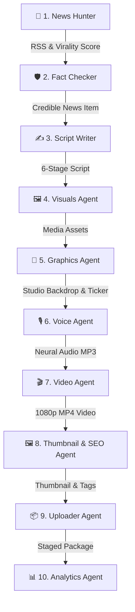

# 📺 AI-NewsTube — Autonomous AI News Broadcasting Pipeline

[](https://www.python.org/)
[](https://groq.com/)
[](https://github.com/rany2/edge-tts)
[](https://threejs.org/)
[](LICENSE)

> **AI-NewsTube** is a 100% autonomous, end-to-end multi-agent AI video production system that automatically discovers breaking news, verifies facts, writes high-retention scripts, generates neural voiceovers, renders 3D WebGL virtual studios with lip-sync presenters, and produces broadcast-ready 1080p MP4 news videos for YouTube — **with zero human intervention**.

---

## 🌟 Key Highlights & Features

* 🤖 **10-Agent Autonomous System**: Orchestrated by a CEO Agent managing specialized sub-agents from news hunting to YouTube SEO packaging.
* 📰 **Real-Time News Ingestion**: Automatically monitors Google News RSS across 9 major categories (Top Stories, India, World, Business, Tech, Entertainment, Sports, Science, Health).
* 🛡️ **Automated Fact Checking**: Verifies story credibility using LLaMA 3.3 70B before script generation, scoring risk levels (`LOW`, `MEDIUM`, `HIGH`).
* 🎙️ **Neural Voice & Lip-Sync**: Expressive Hindi/English neural text-to-speech with real-time RMS audio volume extraction for sync mouth movement.
* 🎥 **3D Virtual News Studio**: WebGL studio space built with Three.js featuring curved LED video walls, specular news desks, volumetric lighting, and camera orbits.
* 🖼️ **5-Tier Visual Research Engine**: Automatically fetches HD news imagery from Wikimedia Commons, NASA, Pexels, Pixabay, and Unsplash.
* 🎬 **Broadcast Graphic Overlays**: 2.5D spatial glass panels, Devanagari kinetic captions, real-time ticker headlines, channel logo watermarks, and audio visualizers.

---

## 🔄 How It Works (Pipeline Workflow)



---

## 📚 Documentation Center

| Document | Description |
| :--- | :--- |
| 🚀 [**TECH_STACK.md**](Md%20files/TECH_STACK.md) | Technical stack breakdown, libraries, and framework details. |
| 📌 [**PROJECT_OVERVIEW.md**](Md%20files/PROJECT_OVERVIEW.md) | High-level summary & pitch for non-technical stakeholders/investors. |
| 🏗️ [**ARCHITECTURE.md**](Md%20files/ARCHITECTURE.md) | Deep technical architecture, data models, rendering engines & lip-sync mechanics. |
| 🤖 [**AGENT_SYSTEM_GUIDE.md**](Md%20files/AGENT_SYSTEM_GUIDE.md) | Detailed specification of all 10 autonomous agents and their tasks. |
| ⚙️ [**SETUP_AND_USAGE.md**](Md%20files/SETUP_AND_USAGE.md) | Complete installation, API key configuration, customization, and troubleshooting guide. |

---

## ⚡ Quick Start

### 1. Prerequisite
* Python 3.10 or higher installed.
* FFmpeg installed and added to system PATH.

### 2. Installation
```bash
# Clone the repository
git clone https://github.com/your-username/AI-NewsTube.git
cd AI-NewsTube

# Install required Python packages
pip install -r requirements.txt
```

### 3. Environment Configuration
Create a `.env` file in the root directory:
```env
GROQ_API_KEY=gsk_your_groq_api_key_here
DEFAULT_TTS_VOICE=hi-IN-SwaraNeural
CHANNEL_NAME=AI-NewsTube
OWNER=Suraj
```
*(Get a free Groq API Key at [https://console.groq.com/keys](https://console.groq.com/keys))*

### 4. Run the Pipeline
```bash
python main.py
```

The system will automatically run all 10 agents and output the final video in `videos/` and thumbnail in `thumbnails/`.

---

## 📁 Directory Structure

```
AI-NewsTube/
├── agents/                  # 10 Autonomous Pipeline Agents
│   ├── ceo_agent.py         # Pipeline orchestrator
│   ├── news_hunter.py       # News discovery & virality ranking
│   ├── fact_checker.py      # LLM Fact checker
│   ├── script_writer.py     # 6-Stage news script writer
│   ├── visuals_agent.py     # Multi-tier visual procurement
│   ├── graphics_agent.py    # 2.5D graphics & studio backdrop
│   ├── voice_agent.py       # Neural TTS voiceover engine
│   ├── video_agent.py       # 1080p MP4 video compositor
│   ├── thumbnail_agent.py   # High-CTR thumbnail & SEO metadata
│   ├── uploader_agent.py    # Staging & distribution packaging
│   └── analytics_agent.py   # Performance feedback telemetry
├── assets/                  # Fonts, avatars, studio backdrops, frames
├── config/                  # Settings (settings.py) & Graphics config
├── data/                    # Telemetry & news data logs
├── logs/                    # System runtime log files
├── models/                  # Dataclass schemas (news_models.py)
├── services/                # Core engines (Groq, Three.js, RSS, Visual Research)
├── thumbnails/              # Rendered YouTube thumbnail outputs
├── utils/                   # Shared Logger & Exception handlers
├── videos/                  # Final 1080p MP4 broadcast video outputs
├── voice/                   # Generated neural MP3 voiceover files
├── main.py                  # Entry point script
├── requirements.txt         # Dependencies list
└── TECH_STACK.md            # Tech stack documentation
```

---

## 🤝 Contributing & License

Contributions are welcome! Please feel free to open issues or submit pull requests.

This project is licensed under the MIT License.
